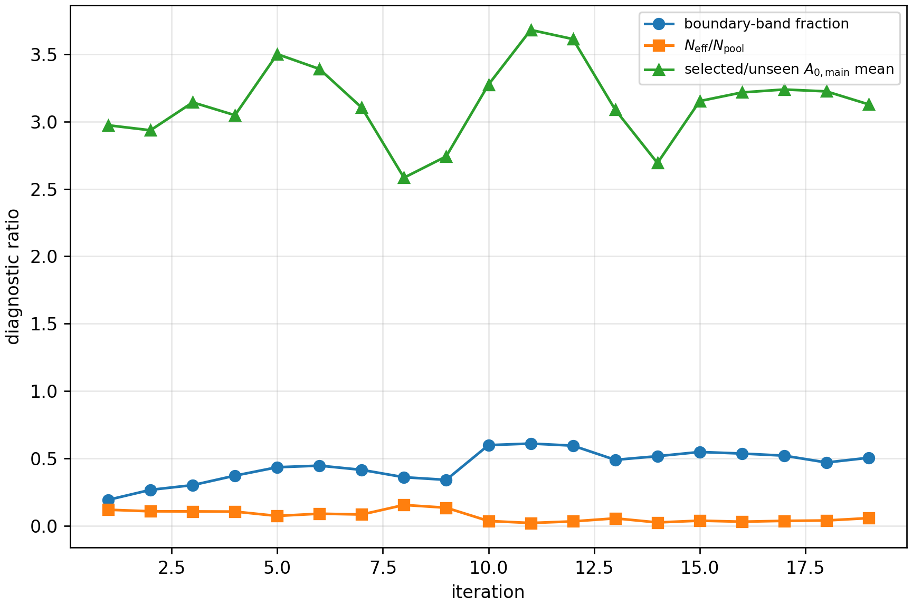
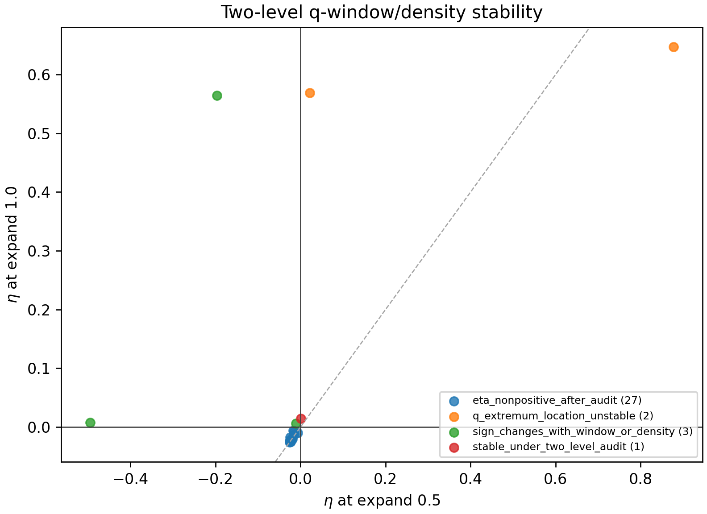
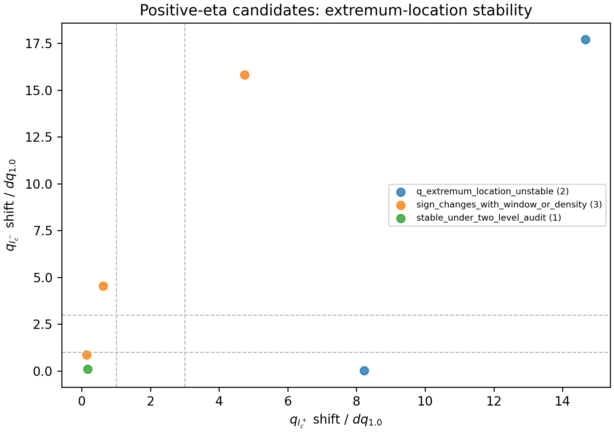
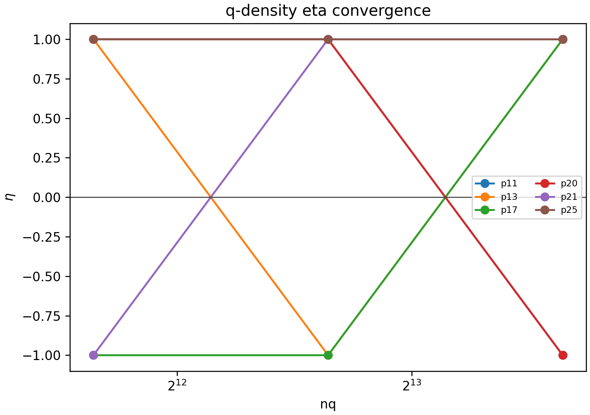
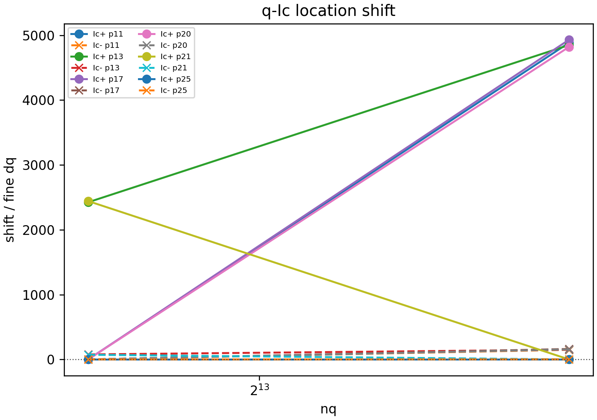
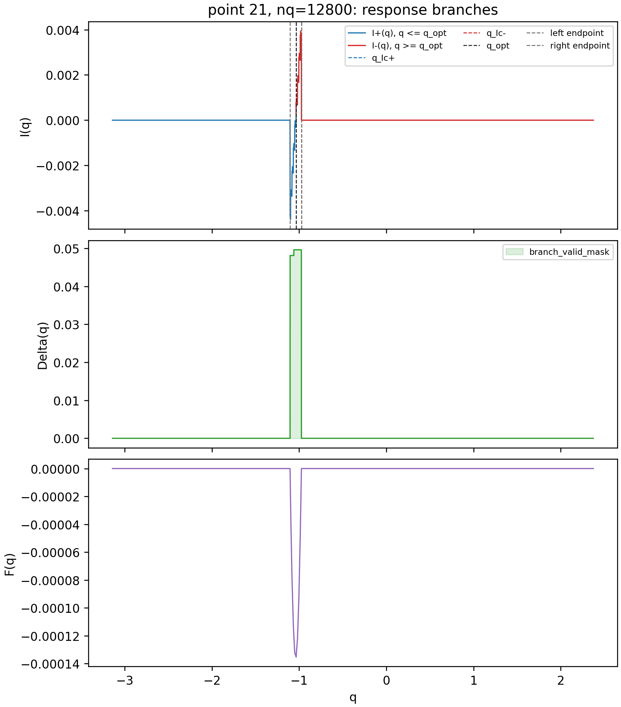
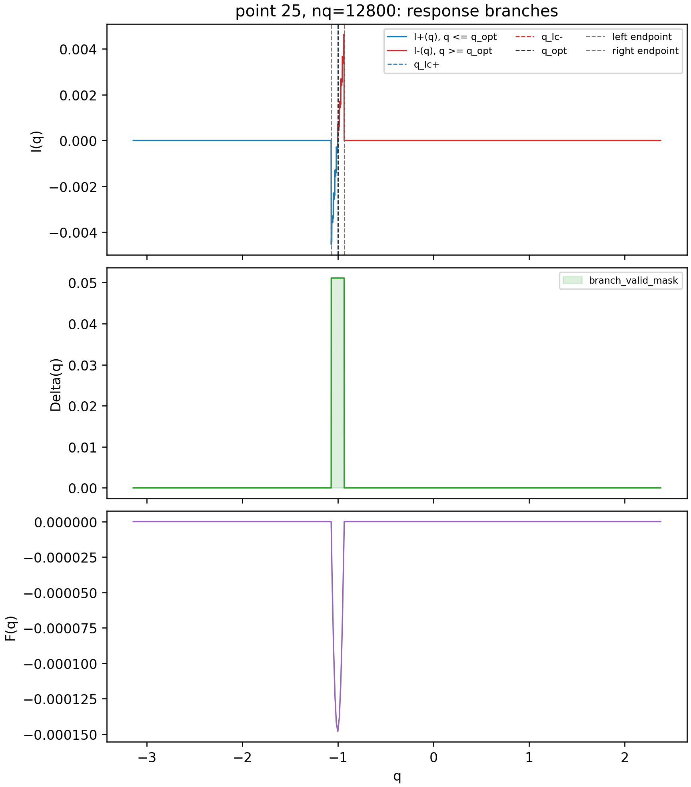

# Numerical Reliability Audit for the Discovery Active-Learning Phase Diagram

Date: May 23, 2026

## Purpose

This note consolidates the numerical checks performed after the discovery-mode active-learning run
`active_boundary_discovery_512seed_256x50`.

The active-learning loop found the main thermodynamic phase structure from random exact seeds, but several high-\(J_A\), low-temperature regions required additional numerical scrutiny. The checks summarized here are audit-only: they do not modify the active-learning data set, the acquisition function, the neural-network surrogate, the StopController, or the production BdG oracle.

The central questions are:

1. Is the normal/SC and uniform-SC/FFLO phase labeling reliable near the high-\(J_A\), low-\(T\) boundary region?
2. Are the apparent high-\(J_A\), positive-\(\eta\) points robust diode responses or numerical response-extraction artifacts?
3. What numerical issues remain unresolved before treating the high-\(J_A\) response and branch structure as final physics?

## Free-Energy Phase Criterion

At each point \((k_B T/t,J_A/t)\), the exact solver scans superconducting ansatz states over \((\Delta,q)\) and compares the best positive-\(\Delta\) candidate to the normal state:

\[
\Delta F_{\min}
= \min_{\Delta>0,q}\left[F(\Delta,q)-F_N\right].
\]

The phase rule is:

\[
\Delta F_{\min} < -\epsilon_F,\quad \Delta_{\rm opt}>\Delta_\epsilon
\quad \Rightarrow\quad \text{superconducting},
\]

\[
\Delta F_{\min} > +\epsilon_F \ \text{or}\ \Delta_{\rm opt}=0
\quad \Rightarrow\quad \text{normal}.
\]

If \(|\Delta F_{\min}|\) is within tolerance, or if the best positive-\(\Delta\) state is extremely close to the normal state, the point is treated as boundary-band or ambiguous rather than silently assigned a hard phase.

Within the superconducting sector, the winning \(q_{\rm opt}\) distinguishes uniform SC and FFLO:

\[
|q_{\rm opt}|\le q_0 \Rightarrow \text{uniform SC}, \qquad
|q_{\rm opt}|>q_0 \Rightarrow \text{FFLO}.
\]

This criterion is physically correct within the scanned numerical window. The remaining risk is coverage: if the chosen \(q\)-window misses a lower-energy superconducting branch, the code can find only the window-local minimum. A \(q_{\rm opt}\)-edge check reduces this risk, but it cannot prove that another lower FFLO branch does not exist outside the scanned window.

## Discovery Run and Revised Exact Phase Diagram

The discovery run used random initial exact points, full-domain candidate selection, and stochastic acquisition sampling. It stopped after discovering stable main thermodynamic boundaries. The final exact sample count was approximately \(5107\) in the reported run. The selected points became strongly boundary-focused relative to a random baseline, and the final report recorded converged main phase boundaries.

## Delta-Refinement and High-\(J_A\) Boundary Audit

The first numerical audit isolated high-\(J_A\) normal/SC boundary-kink points, high-\(J_A\) positive-\(\eta\) points, Delta-ambiguous points, and rerun-required points.

The Delta refinement subset contained \(92\) rows. The stricter Delta refinement changed \(5\) phase labels and left \(4\) boundary-ambiguous points. The new strict phase counts were:

\[
N_{\rm normal}=57,\qquad
N_{\rm FFLO}=30,\qquad
N_{\rm boundary\ ambiguous}=4,\qquad
N_{\rm uniform\ SC}=1.
\]

This audit supports the conclusion that some high-\(J_A\) normal/SC boundary features are tied to near-zero-\(\Delta\) ambiguity rather than a clean, sharply resolved thermodynamic boundary. It does not yet close the separate question of whether a larger \(q\)-window could reveal a lower superconducting branch outside the original scan.

## Response-Level \(q\)-Window Audit for High-\(J_A\) Positive \(\eta\)

The high-\(J_A\), positive-\(\eta\) anomaly audit expanded the \(q\)-window and recomputed the response. The complete q-window audit used \(33\) input points and two expansion levels per point, giving \(66\) q-window rows.

All \(66/66\) rows passed the response-level q-window validity test:

\[
\text{left endpoint found},\quad \text{right endpoint found},\quad
q_{\rm opt}, q_{I_c^+}, q_{I_c^-}\ \text{away from window edges}.
\]

Thus, for the tested response points, the window width itself is no longer the dominant uncertainty.

The complete q-window classification was:

\[
57 \ \text{q-window artifacts},\qquad
9 \ \text{response-stable-positive rows}.
\]

At the point level, after the two-level q-window audit:

\[
27 \ \text{points became non-positive},\quad
3 \ \text{changed sign},\quad
2 \ \text{had unstable extrema locations},\quad
1 \ \text{passed the two-level screen}.
\]

## Fixed-Window \(q\)-Density Convergence Audit

After the q-window width was shown to be sufficient, the remaining issue was q-grid density and response-extremum extraction. The fixed-window q-density audit held the \(q\)-window fixed to the expanded `expand_1.0` range and recomputed six residual candidates:

\[
\text{points } 11, 13, 17, 20, 21, 25,
\qquad n_q=3200,6400,12800.
\]

All \(18/18\) point-density rows returned successfully.

The classification was:

| Classification | Count |
|---|---:|
| density-converged large positive \(\eta\) | 0 |
| weak near-zero positive \(\eta\) | 0 |
| sign-changing artifact | 4 |
| q-extremum-location unstable | 1 |
| unresolved | 1 |

| Point | \(k_B T/t\) | \(J_A/t\) | \(\eta_{6400}\) | \(\eta_{12800}\) | Classification |
|---:|---:|---:|---:|---:|---|
| 11 | 0.002333 | 1.33825 | 1 | -1 | sign-changing artifact |
| 13 | 0 | 1.344875 | -1 | 1 | sign-changing artifact |
| 17 | 0.004667 | 1.32500 | -1 | 1 | sign-changing artifact |
| 20 | 0.007000 | 1.35150 | 1 | -1 | sign-changing artifact |
| 21 | 0 | 1.33825 | 1 | 1 | unresolved |
| 25 | 0 | 1.318375 | 1 | 1 | q-extremum-location unstable |

This result rules out a robust positive-\(\eta\) conclusion for the six residual candidates at the current numerical tolerance. The remaining \(\eta=1\) cases required direct response-curve inspection.

## Response-Curve Pathology Audit

The final audit examined full response curves for points \(21\) and \(25\) at \(n_q=6400,12800\). For each curve, the saved fields were:

\[
q,\quad \Delta(q),\quad F(q),\quad I(q),\quad \text{branch\_valid\_mask}.
\]

The audit plotted the \(I^+(q)\) and \(I^-(q)\) branches separately and marked \(q_{I_c^+}\), \(q_{I_c^-}\), \(q_{\rm opt}\), and the superconducting branch endpoints. It also recorded the top local extrema of each branch.

| Point | \(n_q\) | \(I_c^+\) | \(I_c^-\) | \(|I_c^+|+|I_c^-|\) | Pathology |
|---:|---:|---:|---:|---:|---|
| 21 | 6400 | \(7.38\times10^{-5}\) | 0 | \(7.38\times10^{-5}\) | small denominator |
| 21 | 12800 | \(2.57\times10^{-4}\) | 0 | \(2.57\times10^{-4}\) | branch near zero |
| 25 | 6400 | \(2.07\times10^{-4}\) | 0 | \(2.07\times10^{-4}\) | branch near zero |
| 25 | 12800 | \(3.77\times10^{-5}\) | 0 | \(3.77\times10^{-5}\) | small denominator |

The response rule used here is conservative: if

\[
|I_c^+|+|I_c^-| < 10^{-4},
\]

or if either branch is numerically zero, \(\eta\) is marked ill-conditioned and is not allowed as a positive diode-response claim.

Both point 21 and point 25 have \(\eta=1\) only because \(I_c^-=0\). They must therefore be reported as

\[
\eta\ \text{ill-conditioned / branch-near-zero},
\]

not as robust positive-\(\eta\) physics.

## Current Interpretation

The numerical audits support the following working interpretation:

1. The discovery active-learning workflow found the main thermodynamic normal/SC and uniform-SC/FFLO boundary structure.
2. The free-energy phase criterion is internally consistent within the scanned \((\Delta,q)\) window.
3. The high-\(J_A\), positive-\(\eta\) points are not stable diode-response evidence. Most disappear or change sign after q-window and q-density audits; the remaining \(\eta=1\) points are small-denominator or branch-near-zero pathologies.
4. The dominant remaining uncertainty for the thermodynamic phase diagram is not the \(\eta\) response. It is whether the high-\(J_A\), low-\(T\) free-energy scan covers all relevant FFLO branches.
5. The normal/SC boundary near high \(J_A\) also needs sharper near-zero-\(\Delta\) refinement, because several boundary points remain close to the normal-state energy within numerical tolerance.

## Open Problems and Next Calculation

The most important unresolved calculation is a phase-boundary q-window and branch-minimum audit. This is distinct from the response-level \(\eta\) audit.

For selected high-\(J_A\), low-\(T\), normal/SC-kink points, the next audit should:

1. expand the q-window for the free-energy scan,
2. save \(F_{\min}(q)=\min_\Delta F(\Delta,q)\),
3. extract multiple low-energy local minima, not only the global minimum,
4. compare old and expanded-window phase labels, \(q_{\rm opt}\), \(\Delta_{\rm opt}\), and \(\Delta F\),
5. identify whether a lower FFLO branch appears outside the old window,
6. only then decide whether the high-\(J_A\) normal/SC boundary is stable.

Topology remains another open layer. The old cFFLO/tFFLO reference curves are not pointwise topological labels from the current exact oracle. A final topological phase diagram requires evaluating the topological invariant for each relevant low-energy FFLO local minimum, not just for the final global \(q_{\rm opt}\) state.

## Report Artifacts

This note summarizes data from:

- `numerical_audit_qwindow_delta_v1_result2`
- `numerical_audit_qdensity_v1`
- `numerical_audit_qdensity_v1/response_curve_pathology_audit`

The copied CSV tables in `tables/` contain the fixed-window q-density summary and the final response-pathology summary.
